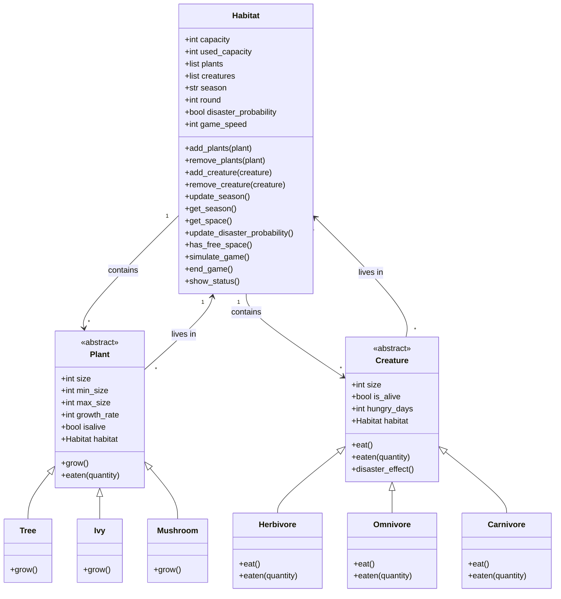

# Dokumentation: EPR-Übung 8 Code Review
**8500551 Mirza, 8811983 Bekker**

---

## Einführung

Diese Dokumentation beschreibt die Implementierung einer objektorientierten Ökosystem-Simulation in Python. Das Modell simuliert ein Habitat mit verschiedenen Lebewesen (Pflanzenfresser, Allesfresser, Fleischfresser) und Pflanzen über mehrere Runden hinweg.

Ziel ist es, das Zusammenwirken von Nahrungsketten, Fortpflanzung, Wachstum und Zufallsereignissen in einem begrenzten Lebensraum darzustellen.

---

## Projektstruktur

Das Projekt besteht aus vier Hauptprogrammen:

### `main.py` — Hauptsteuerung und Benutzeroberfläche

**Ablauf:**
1. Abfrage der Spielergeschwindigkeit (1 = langsam, 2 = mittel, 3 = schnell)
2. Initialisierung von 3 Pflanzenarten (Baum, Efeu, Pilz) mit Parametern
3. Initialisierung von 3 Tierarten (Pflanzenfresser, Allesfresser, Fleischfresser)
4. Habitat-Einstellung basierend auf Gesamtkapazität
5. Hauptsimulationsschleife mit Benutzerinteraktion

---

### `habitat.py` — Habitat-Klasse mit Simulationslogik

**Klasse:** `Habitat` → verwaltet den Lebensraum und koordiniert die Simulation

**Attribute:**

| Attribut | Beschreibung |
|---|---|
| `capacity` | Maximale Kapazität des Habitats |
| `used_capacity` | Aktuell belegter Platz |
| `plants` | Liste aller Pflanzenobjekte |
| `creatures` | Liste aller Tierobjekte |
| `season` | Aktuelle Jahreszeit |
| `round` | Aktuelle Simulationsrunde |
| `disaster_probability` | Katastrophenstatus |

**Kernmethoden:**

| Methode | Beschreibung |
|---|---|
| `simulate_game()` | Führt eine komplette Simulationsrunde durch |
| `update_season()` | Wechselt Jahreszeit im 3-Runden-Zyklus |
| `update_disaster_probability()` | Prüft auf Katastrophen (5% Chance) |
| `show_status()` | Zeigt aktuellen Systemstatus an |

---

### `creatures.py` — Tierklassen (`Creature`, `Herbivore`, `Omnivore`, `Carnivore`)

**Basisklasse:** `Creature` → Abstrakte Repräsentation eines Tieres

**Attribute:**

| Attribut | Beschreibung |
|---|---|
| `size` | Aktuelle Größe |
| `is_alive` | Lebensstatus |
| `hungry_days` | Tage ohne Nahrung |
| `habitat` | Referenz zum zugehörigen Habitat |

**Spezialisierte Klassen:**

#### `Herbivore` (Pflanzenfresser)
- Frisst ausschließlich Pflanzen
- Erfolgswahrscheinlichkeit: 45–65% (abhängig von Pflanzengröße)
- Stirbt nach **2 Tagen** ohne Nahrung

#### `Omnivore` (Allesfresser)
- Wählt zufällig zwischen Pflanzen (50%) und Tieren (50%)
- Jagderfolg: 60%
- Stirbt nach **3 Tagen** ohne Nahrung

#### `Carnivore` (Fleischfresser)
- Jagt ausschließlich andere Tiere (keine Kannibalen)
- Jagderfolg: 60%
- Stirbt nach **3 Tagen** ohne Nahrung

---

### `plants.py` — Pflanzenklassen (`Plant`, `Tree`, `Ivy`, `Mushroom`)

**Basisklasse:** `Plant` → Abstrakte Repräsentation einer Pflanze

**Attribute:**

| Attribut | Beschreibung |
|---|---|
| `size` | Aktuelle Größe |
| `min_size` | Minimale Überlebensgröße |
| `max_size` | Maximale Wachstumsgröße |
| `growth_rate` | Wachstum pro Runde |
| `isalive` | Lebensstatus |
| `habitat` | Referenz zum zugehörigen Habitat |

> **Wachstumslogik:** Pflanzen wachsen abhängig von Jahreszeit und verfügbarem Platz.

---

## Implementierte Simulationsregeln

### Grundregeln

1. **Rundenbasiertes System:** Jede Runde = 1 Monat
2. **Kapazitätslimit:** Habitat kann nicht überfüllt werden
3. **Jahreszeitenzyklus:** Frühling → Sommer → Herbst → Winter
4. **Überlebensmechanik:** Tiere müssen regelmäßig fressen
5. **Pflanzenwachstum:** Abhängig von Jahreszeit und Pflanzenart

### Erweiterte Regeln

#### 1. Jahreszeiteneffekte

| Jahreszeit | Pflanzenwachstum | Jagd |
|---|---|---|
| Frühling | +1 zusätzliches Wachstum | Normal |
| Sommer | Normales Wachstum | Normal |
| Herbst | Kein Wachstum | Normal |
| Winter | Kein Wachstum | Keine Jagd für Räuber |

#### 2. Katastrophensystem
- 5% Chance pro Runde für ein Ereignis, das alle Tiere schädigt

#### 3. Größenabhängige Interaktionen
- Größere Pflanzen sind schwerer zu fressen

#### 4. Artenspezifische Hungertoleranz

| Art | Hungertage |
|---|---|
| Pflanzenfresser | 2 Tage |
| Allesfresser | 3 Tage |
| Fleischfresser | 3 Tage |

#### 5. Intelligente Nahrungswahl
- Allesfresser wägen zwischen Pflanzen und Tieren ab

#### 6. Ökologisches Gleichgewicht
- Fleischfresser jagen keine Artgenossen

#### 7. Kapazitätsmanagement
- Wachstum nur bei verfügbarem Platz

#### 8. Spielgeschwindigkeit

| Geschwindigkeit | Wachstumsrate | Fressintensität (Einheiten/Angriff) |
|---|---|---|
| 1 (langsam) | 3 | 1 |
| 2 (mittel) | 2 | 2 |
| 3 (schnell) | 1 | 3 |

> **Spielmechanik:** Hohe Geschwindigkeit = schnelle, volatile Veränderungen; Niedrige Geschwindigkeit = stabile, nachhaltige Ökosysteme.

#### 9. Pausenmechanismus
- Option `1` im Hauptmenü pausiert die Simulation für 10 Sekunden
- Ermöglicht Beobachtung des aktuellen Zustands ohne weitere Simulation
- Nützlich für detaillierte Analyse der Ökosystemdynamik

---

## Zufallsmechanismen

### Primäre Zufallsaspekte

| Mechanismus | Wahrscheinlichkeit |
|---|---|
| Katastrophenereignisse | 5% pro Runde |
| Pflanzen fressen | 45–65% |
| Tierjagd | 60% |

### Sekundäre Zufallsfaktoren

- **Nahrungsauswahl:** Allesfresser-Entscheidung (50/50)
- **Zielauswahl:** Zufällige Auswahl verfügbarer Beute
- **Katastrophenintensität:** Gleichmäßiger Schaden für alle Tiere

---

## Benutzeroberfläche und Steuerung

### Initialisierungsphase

```
Spielgeschwindigkeit wählen:
  1: langsam
  2: medium
  3: schnell
```

**Pflanzenparameter (pro Art):**
- Aktuelle Größe
- Minimale Größe
- Maximale Größe

**Tierparameter (pro Art):**
- Startgröße

### Hauptmenü

Nach jeder Runde:

```
1: Runde pausieren
2: Nächste Runde simulieren
q: Spiel beenden
```

### Statusanzeige

Pro Runde werden ausgegeben:
- Rundennummer und Jahreszeit
- Habitat-Auslastung (belegt/gesamt)
- Status aller Pflanzen und Tiere
- Ereignisprotokoll (Tode, Wachstum, Katastrophen)

### Spielende

Automatisches Ende bei:
- Aussterben aller Pflanzen
- Aussterben aller Tiere

---

## UML-Diagramm



> **Hinweise zum Diagramm:**
> - Jahreszeiten wechseln alle 3 Runden
> - Katastrophen treten zufällig mit 5% Wahrscheinlichkeit auf
> - Pflanzenwachstum hängt von der Jahreszeit ab: Frühling = schneller, Sommer = normal, Herbst/Winter = kein Wachstum
