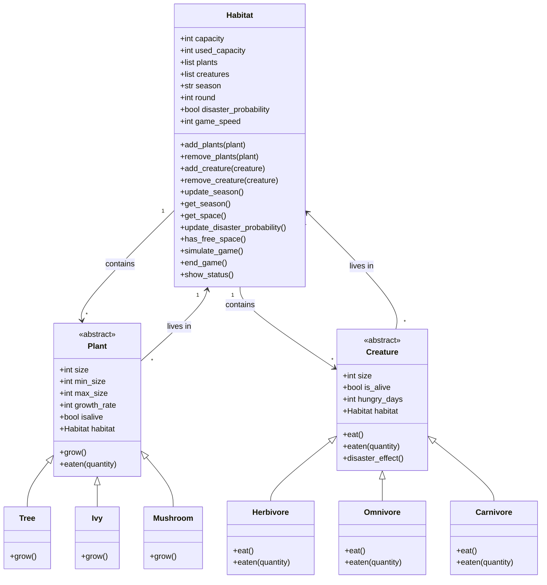

# Documentation: EPR Exercise 8 Code Review
**8500551 Mirza, 8811983 Bekker**

---

## Introduction

This documentation describes the implementation of an object-oriented ecosystem simulation in Python. The model simulates a habitat with various living creatures (herbivores, omnivores, carnivores) and plants over multiple rounds.

The goal is to represent the interplay of food chains, reproduction, growth, and random events within a limited living space.

---

## Project Structure

The project consists of four main programs:

### `main.py` — Main Control and User Interface

**Flow:**
1. Prompt for game speed (1 = slow, 2 = medium, 3 = fast)
2. Initialization of 3 plant species (Tree, Ivy, Mushroom) with parameters
3. Initialization of 3 animal species (Herbivore, Omnivore, Carnivore)
4. Habitat setup based on total capacity
5. Main simulation loop with user interaction

---

### `habitat.py` — Habitat Class with Simulation Logic

**Class:** `Habitat` → manages the living space and coordinates the simulation

**Attributes:**

| Attribute | Description |
|---|---|
| `capacity` | Maximum capacity of the habitat |
| `used_capacity` | Currently occupied space |
| `plants` | List of all plant objects |
| `creatures` | List of all creature objects |
| `season` | Current season |
| `round` | Current simulation round |
| `disaster_probability` | Disaster status |

**Core Methods:**

| Method | Description |
|---|---|
| `simulate_game()` | Executes a complete simulation round |
| `update_season()` | Changes season in a 3-round cycle |
| `update_disaster_probability()` | Checks for disasters (5% chance) |
| `show_status()` | Displays the current system status |

---

### `creatures.py` — Animal Classes (`Creature`, `Herbivore`, `Omnivore`, `Carnivore`)

**Base Class:** `Creature` → Abstract representation of an animal

**Attributes:**

| Attribute | Description |
|---|---|
| `size` | Current size |
| `is_alive` | Life status |
| `hungry_days` | Days without food |
| `habitat` | Reference to the associated habitat |

**Specialized Classes:**

#### `Herbivore`
- Eats plants exclusively
- Success probability: 45–65% (depending on plant size)
- Dies after **2 days** without food

#### `Omnivore`
- Randomly chooses between plants (50%) and animals (50%)
- Hunting success: 60%
- Dies after **3 days** without food

#### `Carnivore`
- Hunts other animals exclusively (no cannibalism)
- Hunting success: 60%
- Dies after **3 days** without food

---

### `plants.py` — Plant Classes (`Plant`, `Tree`, `Ivy`, `Mushroom`)

**Base Class:** `Plant` → Abstract representation of a plant

**Attributes:**

| Attribute | Description |
|---|---|
| `size` | Current size |
| `min_size` | Minimum survival size |
| `max_size` | Maximum growth size |
| `growth_rate` | Growth per round |
| `isalive` | Life status |
| `habitat` | Reference to the associated habitat |

> **Growth Logic:** Plants grow depending on the current season and available space.

---

## Implemented Simulation Rules

### Basic Rules

1. **Round-based System:** Each round = 1 month
2. **Capacity Limit:** Habitat cannot be overfilled
3. **Season Cycle:** Spring → Summer → Autumn → Winter
4. **Survival Mechanic:** Animals must feed regularly
5. **Plant Growth:** Depends on season and plant species

### Extended Rules

#### 1. Seasonal Effects

| Season | Plant Growth | Hunting |
|---|---|---|
| Spring | +1 additional growth | Normal |
| Summer | Normal growth | Normal |
| Autumn | No growth | Normal |
| Winter | No growth | No hunting for predators |

#### 2. Disaster System
- 5% chance per round for an event that damages all animals

#### 3. Size-Dependent Interactions
- Larger plants are harder to eat

#### 4. Species-Specific Hunger Tolerance

| Species | Hunger Days |
|---|---|
| Herbivore | 2 days |
| Omnivore | 3 days |
| Carnivore | 3 days |

#### 5. Intelligent Food Selection
- Omnivores weigh options between plants and animals

#### 6. Ecological Balance
- Carnivores do not hunt members of their own species

#### 7. Capacity Management
- Growth only occurs when space is available

#### 8. Game Speed

| Speed | Growth Rate | Feeding Intensity (units/attack) |
|---|---|---|
| 1 (slow) | 3 | 1 |
| 2 (medium) | 2 | 2 |
| 3 (fast) | 1 | 3 |

> **Game Mechanic:** High speed = fast, volatile changes; Low speed = stable, sustainable ecosystems.

#### 9. Pause Mechanism
- Option `1` in the main menu pauses the simulation for 10 seconds
- Allows observation of the current state without further simulation
- Useful for detailed analysis of ecosystem dynamics

---

## Random Mechanisms

### Primary Random Aspects

| Mechanism | Probability |
|---|---|
| Disaster events | 5% per round |
| Eating plants | 45–65% |
| Animal hunting | 60% |

### Secondary Random Factors

- **Food selection:** Omnivore decision (50/50)
- **Target selection:** Random selection of available prey
- **Disaster intensity:** Equal damage to all animals

---

## User Interface and Controls

### Initialization Phase

```
Choose game speed:
  1: slow
  2: medium
  3: fast
```

**Plant parameters (per species):**
- Current size
- Minimum size
- Maximum size

**Animal parameters (per species):**
- Starting size

### Main Menu

After each round:

```
1: Pause round
2: Simulate next round
q: Quit game
```

### Status Display

Output per round:
- Round number and season
- Habitat utilization (used/total)
- Status of all plants and animals
- Event log (deaths, growth, disasters)

### End of Game

Automatic end when:
- All plants go extinct
- All animals go extinct

---

## UML Diagram



> **Diagram Notes:**
> - Seasons change every 3 rounds
> - Disasters occur randomly with a 5% probability
> - Plant growth depends on the season: Spring = faster, Summer = normal, Autumn/Winter = no growth
